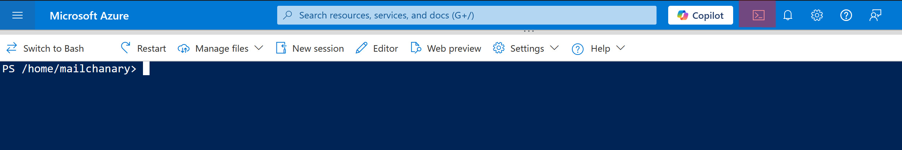
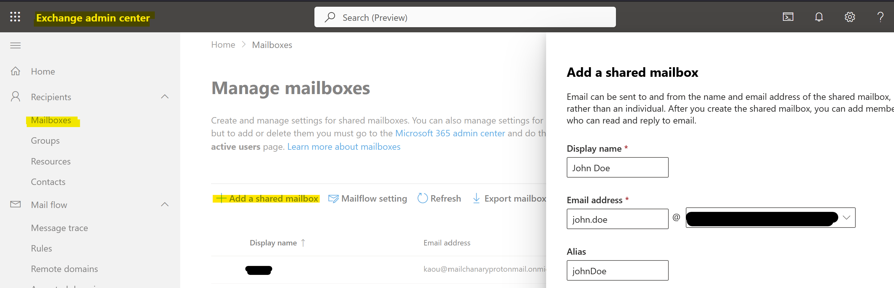
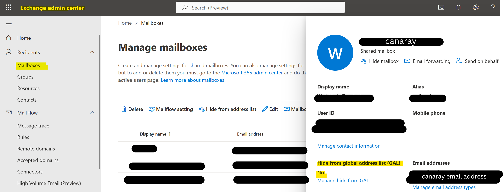
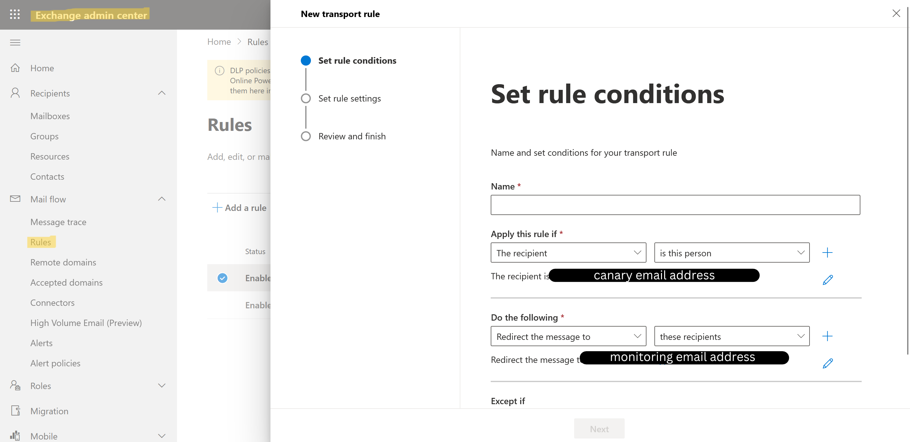

# 🕵️‍♂️📬👨🏻‍💻 Email🇨🇭anary


> **EmailCHanary**: Canary-style email beaconing for detecting your (and your clients') compromised Azure users.

## 🔍 What is EmailCHanary?

As date of today, **EmailCHanary** is a lightweight and stealthy experiment script designed to **detect compromised Microsoft Azure email clients**. It works by deploying decoy (canary) email addresses that alert you when they receive email, signaling potential user account compromise.

Think of it as a tripwire for your cloud-based email clients. If someone send an email to the email address bait, you'll know.

## Python Implementation

The Python implementation provides a more structured approach to creating email canaries. It supports both internal shared mailboxes and external contacts.

### Prerequisites
- Python 3.6 or higher
- PowerShell 7.0 or higher
- Exchange Online PowerShell module
- Microsoft Graph PowerShell module

### Installation
1. Install required Python packages:
```bash
pip install -r requirements.txt
```

2. Install required PowerShell modules:
```powershell
Install-Module -Name ExchangeOnlineManagement -Force -AllowClobber
Install-Module -Name Microsoft.Graph -Force -AllowClobber
```

### Usage
Run the Python script:
```bash
python create_shared_mailbox.py
```

The script will guide you through:
1. Creating an internal shared mailbox with forwarding
2. Creating an external contact
3. Setting up GAL visibility

### Current Limitations
- Authentication requires multiple popups (one per command)
- Forwarding is limited to single email address
- Group forwarding is not implemented

---

## ✨ Features

- 🛡️ **Early breach detection** for Microsoft 365 / Azure email environments
- 📨 **Deploys decoy emails** that silently trigger alerts when opened
- 🔗 **Email-based alerting**
- 👥 **Internal and external email baits**: both own-company users and external users bait.
- 📊 **Logging & Reporting** support for incident response
- 🧰 Easy integration with SIEM or SOC pipelines

---

## 🚀 Getting Started

### Prerequisites

- Azure AD / Microsoft 365
- Basic knowledge of Powershell and Azure security best practices
- Sufficient privilege to create shared mailbox (the canaray mailbox) and to add a forwarding rule to it (to some monitoring email addresses)

### Installation

##### Fast installation

> **IMPORTANT: This script only supports to be executed as a User in the Azure Portal Powershell terminal in a browser. You need to have sufficient privilege to create shared mailbox or AD User (i.e. the canaray mailbox) and to add a forwarding rule to it (to some monitoring email addresses). This is not recommended or please review the scripts [entrypoint.ps1](./entrypoint.ps1) before executing it.**

1. Open [Azure Portal](https://portal.azure.com/#home) or the exchange admin center https://admin.exchange.microsoft.com/#/
2. Open the Azure Powershell:



3. Execute the below command:

```powershell
Invoke-WebRequest -Uri "https://raw.githubusercontent.com/grennault/emailCHanary/main/entrypoint.ps1" -OutFile "entrypoint.ps1"; & "./entrypoint.ps1"
```

4. Follow the instructions


##### Manual installation

1. Create a canary shared mailbox __OR__ a canary AD user:

Create a shared mailbox:

E.g. with Powershell:

```powershell
New-Mailbox -Shared
    -Name $SharedMailboxName
    -Alias $SharedMailboxAlias
    -PrimarySmtpAddress $SharedMailboxEmail
```

E.g. In [EAC](https://admin.cloud.microsoft) [with UI](https://learn.microsoft.com/en-us/exchange/collaboration-exo/shared-mailboxes#use-the-eac-to-create-a-shared-mailbox):



Ensure GAL visibility is enabled so that the shared email address is visible for user in your organization



 __OR__

Create an AD user:

E.g. 

```powershell
New-AzureADUser -DisplayName "John Doe" -UserPrincipalName 
    "johndoe@yourdomain.onmicrosoft.com" 
    -EmailAddress "johndoe@example.com"
    -AccountEnabled $true 
    -PasswordProfile (New-Object -TypeName Microsoft.Open.AzureAD.Model.PasswordProfile 
    -Property @{Password = "YourPasswordHere"})
```

Add an Outlook Exchange licence to the user (to obtain a working email address)

2. Add forwarding rule from the previously created canaray email to a monitoring email

E.g. In [EAC](https://admin.cloud.microsoft) [with UI](https://learn.microsoft.com/en-us/exchange/recipients-in-exchange-online/manage-user-mailboxes/configure-email-forwarding):

s

---

## Help us

#### Support us

<a href="https://www.buymeacoffee.com/grennault" target="_blank"></a>

#### Community & contact

- [Github Discussion](https://github.com/grennault/emailCHanary/discussions): sharing feedbacks and asking questions.
- [Github Issue](https://github.com/grennault/emailCHanary/issues): bugs reporting and feature requests.

**Contributors**

<a href="https://github.com/grennault/emailCHanary/graphs/contributors">
  
</a>

#### Star History

<a href="https://www.star-history.com/#grennault/emailCHanary&Timeline">
 <picture>
   <source media="(prefers-color-scheme: dark)" srcset="https://api.star-history.com/svg?repos=grennault/emailCHanary&type=Timeline&theme=dark" />
   <source media="(prefers-color-scheme: light)" srcset="https://api.star-history.com/svg?repos=grennault/emailCHanary&type=Timeline" />
   
 </picture>
</a>

---

## 🐍 Python Implementation

The Python implementation provides a more structured approach to creating email canaries. It supports both internal shared mailboxes and external contacts.

### Prerequisites
- Python 3.6 or higher
- PowerShell 7.0 or higher
- Exchange Online PowerShell module
- Microsoft Graph PowerShell module

### Installation
1. Install required Python packages:
```bash
pip install -r requirements.txt
```

2. Install required PowerShell modules:
```powershell
Install-Module -Name ExchangeOnlineManagement -Force -AllowClobber
Install-Module -Name Microsoft.Graph -Force -AllowClobber
```

### Usage
Run the Python script:
```bash
python create_shared_mailbox.py
```

The script will guide you through:
1. Creating an internal shared mailbox with forwarding
2. Creating an external contact
3. Setting up GAL visibility

### Current Limitations
- Authentication requires multiple popups (one per command)
- Forwarding is limited to single email address
- Group forwarding is not implemented
